## Hi Welcome to see this VibeCoding product
> The core functionality of this plugin is to greatly enrich the interactivity and functionality of Minecraft villager AI.

### 插件介绍
- 编译:Maven Java21＋
- 适配平台:PaperMC26.2 Folia26.1.2＋
- 模型:Claude Fable5 GPT5.6-Sol/Terra/Luna GLM5.2 Grok4.5

### 核心功能介绍
- 村庄内部的阶级职业分化
- 详细村民信息(独一无二的每个人)
- 村民能够自主防卫村庄
- 村民能够主动的攀谈交流
- 各村庄之间的外交关系
- 村民AI自主驱动升级村庄
- 100％可DIY的Prompt提示词
- 在不破坏生电玩法的前提下 提供类RPG服务器的玩法

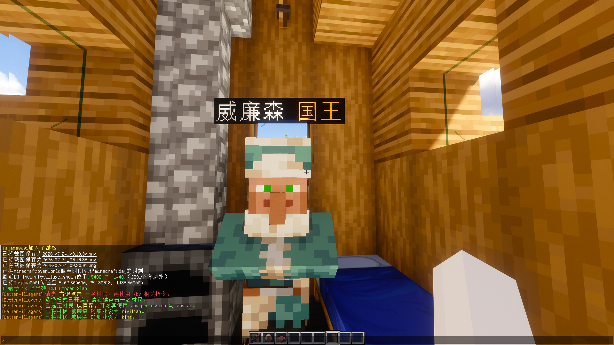

#### 村庄内部的阶级职业分化
> 具体请看professions.yml
```yml
职业:国王 骑士 士兵 弓箭手 建筑师 农民 矿工 厨师 屠夫 商人 医生 渔夫 附魔师 铁匠铺老板 普通人.....

每个职业都有自己的:
- 生命/攻击/防御数值
- 专属装备与外观
- 行为权重(巡逻/战斗/种田/建造/交易...)
- 性格参数(勇敢度 贪婪度)
- 方块操作白名单
- 独立交易商品(可带附魔)

国王每村仅一位 不参与常规加权
普通人权重最高 农民次之 战斗职业与工匠按配额平衡
繁殖后代有概率继承父母职业 也可由管理员强制指派
```
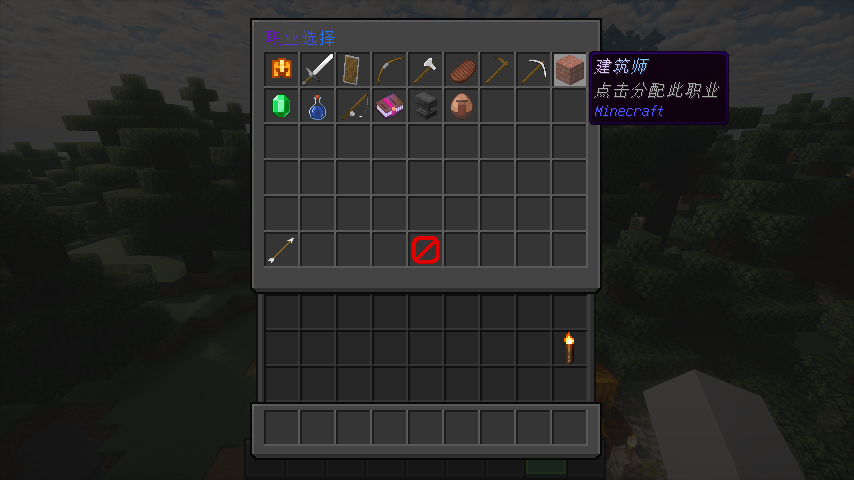

#### 详细村民信息(独一无二的每个人)
> 不是批量复制粘贴的NPC 是能记住自己是谁的村民
```yml
每位村民拥有:
- 独一无二的名字(中世纪风格 可由AI起名)
- 独立职业与头顶显示
- 性格:勇敢 / 贪婪 等参数影响决策偏置
- 短期记忆 + 长期记忆(恩怨 关系 关键事件)
- 独立状态机:空闲 / 工作 / 巡逻 / 战斗 / 逃跑 / 休息 / 交易
- 装备耐久与破损状态

进入村庄范围时会提示:
村名 | 国王 | 当前人口
```

#### 村民能够自主防卫村庄
> 遇袭不傻站 有人逃有人冲
```yml
威胁识别:
- 僵尸 骷髅 掠夺者等敌对生物
- 攻击村民的非法玩家
- 岩浆 悬崖 火焰等环境危险

分层反应:
- 反射层:被打闪避 逃离岩浆 灭身上的火 不调大模型
- 战术层:是否迎战 是否呼叫支援 巡逻路线
- 战斗职业优先ATTACK 非战斗职业优先FLEE并求助
- 骑士/士兵/弓箭手可主动反击 保护其他村民
- 夜间倾向回安全区
```
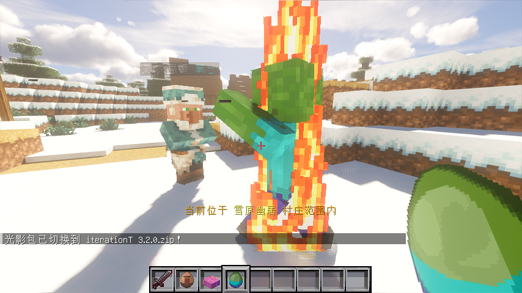

#### 村民能够主动的攀谈交流
> 路上遇到不同职业的邻居 会驻足聊两句
```yml
社交行为:
- 跨职业相遇时驻足攀谈，双方会面朝对方并暂时进入社交状态
- AI 生成的问候必须点名对方，并围绕对方职业职责展开；AI 不可用时自动使用本地 i18n 问候语
- 双方头顶通过原生 TextDisplay 短暂显示独立聊天气泡，结束、死亡或区块卸载时自动清理
- 与玩家可通过 /bv ai chat 对话
- 回答严格使用真实村庄事实，禁止瞎编国王/村名/人口
- 玩家通过 `/bv ai chat` 提问时，村民会读取玩家当前主手、头盔、胸甲、护腿与靴子的真实物品，并仅基于这些装备事实回答相关问题
```
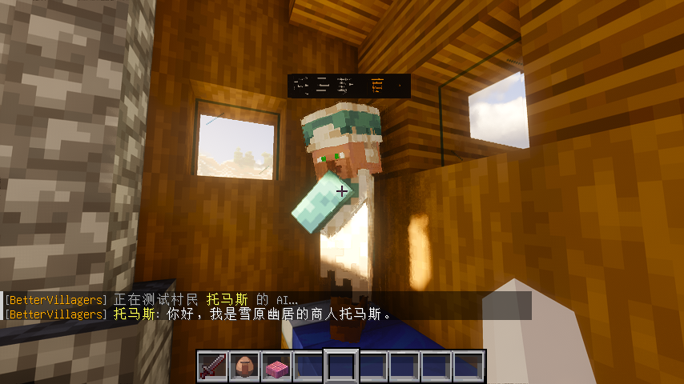

```yml
部分职业:
- 医生:
  - 村民血量低于等于最大生命值 2% 时主动寻找附近医生
  - 医生使用缓慢治疗逻辑逐步恢复低血量村民，直到满血
- 渔夫:
  - 村庄附近存在水源时装备鱼竿并创建原版 FishingHook
  - 使用原版鱼竿动作和钓鱼钩机制，不伪造 PlayerFishEvent
- 附魔师:
  - 为符合条件的受损物品添加附魔
  - 通过村民交易提供附魔后的工具、武器和装备
- 铁匠铺老板:
  - 闲时消耗库存中的铁锭修复受伤铁傀儡
  - 提供铁制工具交易

农民增强:
- 继续负责播种、收获和水源附近开垦荒地
- 使用剪刀逻辑收集羊毛
- 只有库存拥有空桶时才会挤奶，并将空桶替换为牛奶桶

通用行为:
- 任意职业村民都有小概率主动喂养附近的猫或狼
- 低血量、工作、社交和交易状态会互相影响行为优先级
```

#### 主动贸易、好感与村民关系
> 村民之间会根据职业商品和库存条件主动进行真实物品交换。
```yml
主动贸易:
- A 村民向附近符合条件的 B 村民发起交易
- 使用 B 村民已有的 MerchantRecipe 作为交易依据
- A 支付交易材料并获得商品，B 获得支付材料
- 交易双方头顶通过 ItemDisplay 展示各自实际收到的物品，并在展示到期后自动清理
- 物品展示直接使用交易 ItemStack，可保留 CraftEngine 自定义物品数据、CustomModelData 与资源包模型
- 交易成功后更新 MerchantRecipe 使用次数和需求价格
- 交易成功会提升双方好感，好感越高交易折扣越高
- 好感达到阈值后双方显示爱心，并有冷却限制地生成小村民

玩家交易:
- 玩家右键村民仍打开原版 Merchant 交易界面
- 真实成功交易通过 VillagerTradeEvent 记录并提升关系
- 插件不会取消或伪造玩家交易事件

```

#### 各村庄之间的外交关系
> 村与村不再是孤立的点 而是有关系网的世界
```yml
外交状态:
- 同盟
- 中立
- 敌对

关系变更会有提示
后续行为(支援 敌意 边界态度)会受外交状态影响
```

#### 村民AI自主驱动升级村庄
> 要想富先修路 国王带队 建筑师落地
```yml
发展四阶段(禁止跳阶段):
1) ROADS          道路网络覆盖核心区
2) STREETSCAPE    路灯/行道树/街边设施
3) HOUSING        房屋/房屋升级/农田/市集
4) DEFENSE_LANDSCAPE  环境景观与防御城墙闭环

建造类型举例:
道路 街景 房屋 房屋升级 农田 市集 景观 城墙.....

施工异步分阶段推进:
SITE_PREP → FOUNDATION → STRUCTURE → DETAIL

还有集体活动:
市集 防御演习 收获庆典 建筑竞赛.....

建筑师会评估地形 合理平整 但不破坏原版柏林地形自然性
生电保护区内不乱动方块
```
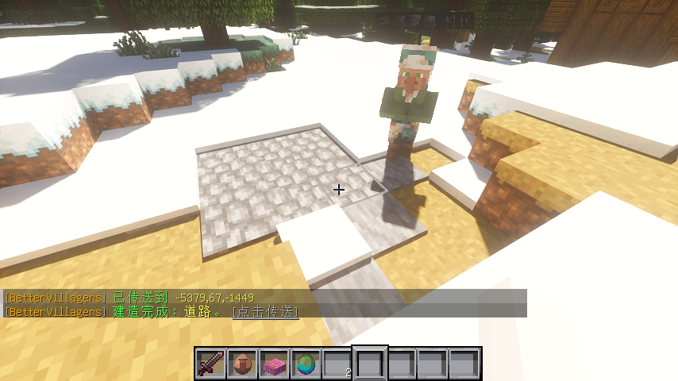

#### NBT 结构模板与建造系统
> 参考 Minecraft 数据包结构生成思路 内置原版NBT系统，村民按步骤逐块施工。
```yml
1) 按模板真实尺寸做场地评估
- 先按候选模板/建筑群最大占地计算评估半径
- 再做地形快照、坡度、水域、障碍与改造成本判断
- 大型堡垒/树屋不会只检查中心几格就动工

2) 道路连接器图拼接
- avenue / corner / crossroad / bridge / avenue_end 进入道路模块库
- 维护开放端口拓扑：直路前进、转角分叉、十字路口多出口、尽头终止
- 道路模块按真实边界尺寸占位，不再生成固定十字硬编码道路

3) 原版 NBT + JSON/SNBT 兼容
- 优先读取原版 structure `.nbt`（支持 gzip / 未压缩）
- 解析 size / palette / blocks，转换为 ConstructionStep 逐块施工
- 数据目录 structures/ 可被服主覆盖；缺失时从 jar 内置资源释放
- JSON/SNBT 作为可编辑回退格式，便于手写补块与元数据扩展

4) 模板旋转、镜像与入口对齐
- 支持 NONE / 90° / 180° / 270° 旋转
- 支持左右/前后镜像
- 同步旋转镜像 BlockData 中的 facing / axis / rail shape
- 道路模块按连接方向选择 placement，房屋/功能建筑默认居中锚定

5) 多生物群系模板池
- 平原 / 沙漠 / 热带草原 / 雪地 / 针叶林 / 沼泽 / 樱花
- 住宅、农田、市集按生物群系选池，再按稳定种子挑选具体模板
- 无对应群系模板时回退平原风格
- 当前 jar 内置约 100+ 个白名单 NBT（道路、住宅、农田、市集、特色建筑）

6) 特色建筑群 (Structure Cluster)
- 不是单栋随机地标，而是可组合的建筑群
- 例：frontier_fort / frozen_fort / jungle_canopy
- 根模板 + 必需/可选附属建筑
- 人口解锁、生物群系限制、统一占地、一个原子施工任务
- 已建成群组会记录并防重复

7) 布局与道路端口持久化
- build_layouts：模板 ID、中心、占地、旋转、镜像、cluster_id
- road_ports：村庄开放道路连接器
- 启动恢复占位、阶段计数、群组去重与道路拓扑
- 道路端口在施工完工后提交；取消时回滚入口，避免幽灵连接器

8) 方块实体与特殊方块安全策略
- 允许生成：门、床、楼梯、铁轨等普通方块状态
- 容器类（箱子/木桶/熔炉/漏斗等）：允许放置，但库存强制清空
- 告示牌：允许放置，但文本强制清空
- 跳过：刷怪笼、命令方块、拼图方块、结构方块、传送门
- 不恢复 LootTable / 模板实体 / 原始方块实体 NBT
```
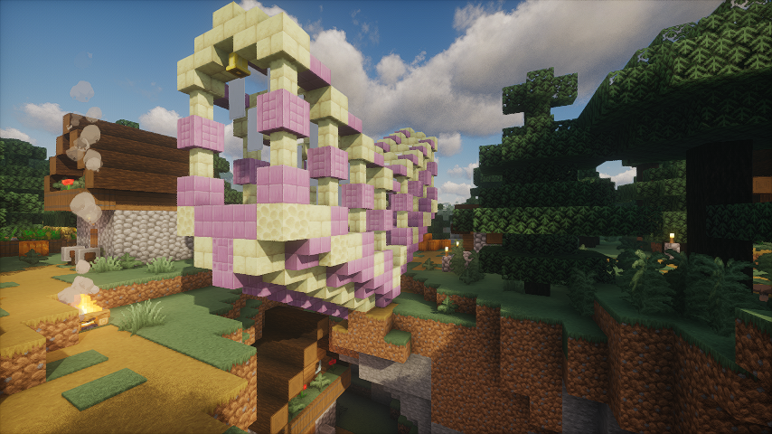

#### 100％可DIY的Prompt提示词
> 提示词不在代码里锁死 全在 prompt.yml 里 想改就改
```yml
可自定义模板包括:
- 战术层决策
- 国王战略规划
- 建筑师建造/施工推演
- 商人交易公平判断
- 村庄命名 / 村民命名
- 玩家与村民聊天
- 跨职业社交攀谈
- AI连通性测试

占位符示例:
{name} {profession} {state} {loc} {threats}
{pop} {bravery} {greed} {village} {king} {message}.....

改完 /bv reload 即可热加载
多厂商支持:openai claude deepseek glm kimi custom
可配降级链 熔断器 限流 决策缓存
```
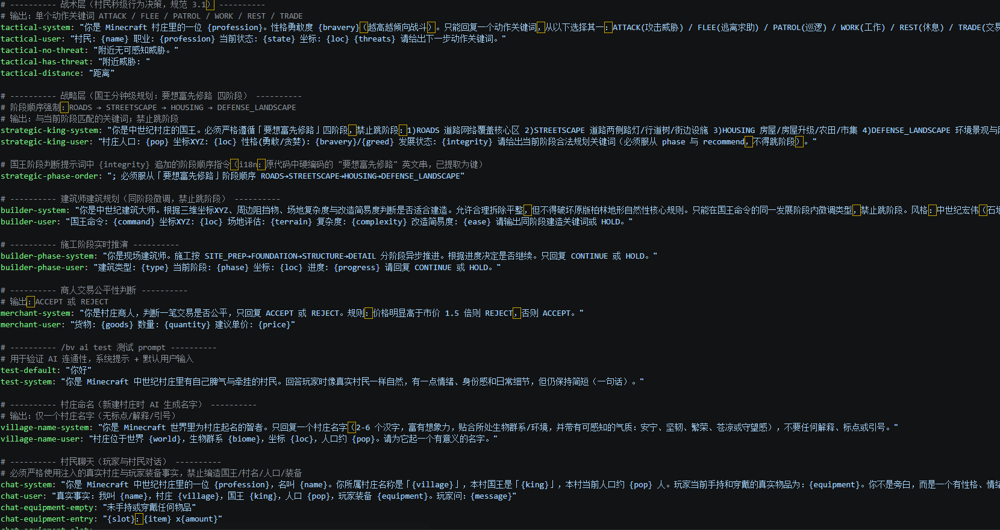

#### 在不破坏生电玩法的前提下 提供类RPG服务器的玩法
> 技术服与叙事服可以共存 一刀切不是我们的风格
```yml
生电模式(redstone-mode):
- 保护区内:AI关闭 恢复纯原版逻辑
  不决策 不交互方块 不组织化 交易回归原版
- 保护区外:正常启用全部AI玩法

保护区可用 /bv region 管理
支持WorldEdit选区创建
可用粒子可视化边界

原版兼容承诺:
- 不干扰繁殖 / 铁傀儡 / 袭击
- 保持工作站绑定
- 不改原版交易表结构(仅动态调价)
```
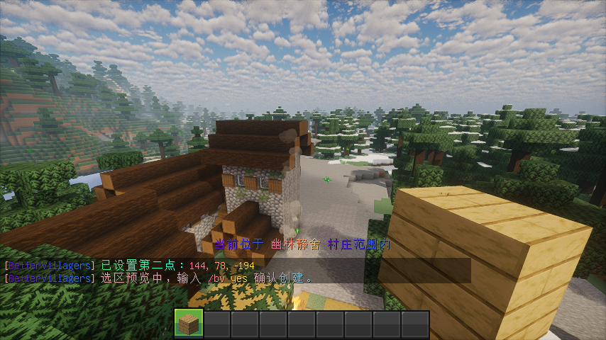

### 快速开始
```yml
1. 确认服务端:Paper 26.2 或 Folia 26.1.2＋
2. 放入 plugins 后启动一次 生成配置
3. 编辑 config.yml 填入 AI provider 与 api-key
4. (可选) 安装 CraftEngine 26.7.4；本插件以 softdepend 方式对接其 API，不会打包 CraftEngine 本体
5. (可选) 微调 professions.yml / prompt.yml / lang/zh_CN.yml
6. /bv reload 重载
7. 走近自然村庄 看人口上来后国王出现 世界开始转起来
```

### 命令一览
> 主命令 /bettervillagers 别名 /bv
```yml
/bv help                          帮助
/bv sel                           开启选择模式 右键点村民
/bv profession <职业>             指派已选村民职业(需admin)
/bv village info|king|stats       查看附近村庄信息
/bv ai toggle|reset|test|chat     AI开关/重置记忆/测试/对话
/bv region create|delete|list|info|viz   生电保护区
/bv reload                        重载配置与提示词
/bv debug                         运行状态(平台 村民数 熔断等)
/bv tp x,y,z,world                传送(建造消息点击用)
```
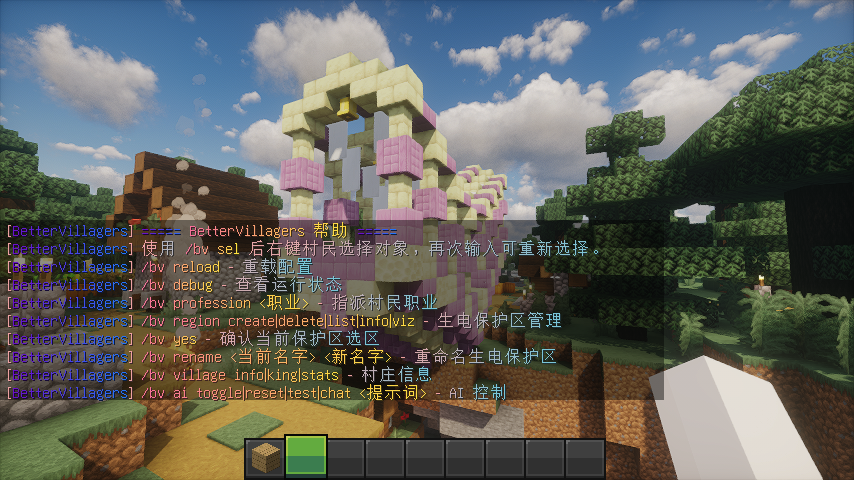

### 权限节点
```yml
bettervillagers.use              基础命令 默认true
bettervillagers.admin            完全管理 默认op
bettervillagers.redstone.create  创建生电保护区
bettervillagers.redstone.modify  修改保护区
bettervillagers.redstone.delete  删除保护区
```

### 配置文件地图
```yml
plugins/BetterVillagers/
  config.yml          # 主配置 AI 性能 功能开关 生电 存储 村庄
  professions.yml     # 职业数值 装备 权重 交易
  prompt.yml          # 全部AI提示词 100%可DIY
  lang/zh_CN.yml      # 全部玩家可见文案 i18n
  structures/         # 原版 NBT 结构模板库(可覆盖 jar 内置)
  bettervillagers.db  # 默认SQLite存储(可改MySQL)
```
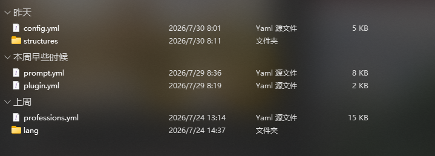

#### 主配置里最常摸的几项
```yml
ai:
  provider: "openai"   # openai claude deepseek glm kimi custom
  providers:
    openai:
      api-key: "你的key"
      api-endpoint: "https://api.openai.com/v1"
      model: "gpt-3.5-turbo"
  fallback-providers: []   # 例: ["deepseek","glm"]

features:
  ai-behavior: true
  block-interaction: true
  autonomous-building: true
  self-defense: true
  auto-trading: true
  profession-tasks: true
  social-interaction: true

performance:
  max-active-ai-villagers: 50
  ai-update-interval: 5
  strategic-interval: 60

storage:
  type: "sqlite"   # 或 mysql

village:
  detection-radius: 64
  king-spawn-population: 6
```

### 使用场景
```yml
生存服: 让村庄真正"活"起来 有人种地 有人巡逻 有人盖房
RPG服: 职业分化 + 对话 + 外交 + 王朝式发展 叙事感拉满
生电/技术服: 交易所与红石机划保护区 内外两套逻辑互不打架
单人/联机剧情: 跟村民聊天 看国王规划 看城墙一点点合拢
```

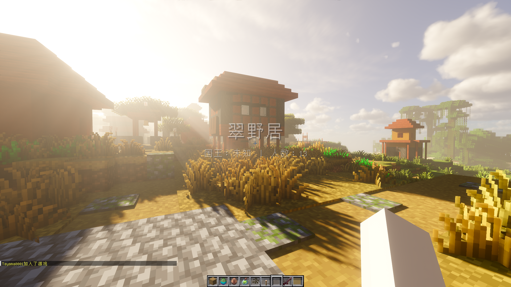

### 注意事项
```yml
- 必须先配置可用的 AI Key 否则决策会降级为规则行为
- 人口达到 king-spawn-population 设定值后才会尝试出现国王
- 操作村民前请先 /bv sel 再右键选定对象
- 配置文件带 ver 字段 勿手改版本号 升级后若提示不匹配 建议备份后让插件重生
- 熔断开启时会临时走规则层 属正常保护 不是坏了
- Folia 下请勿使用旧式主线程调度 本插件已做区域线程适配
- CraftEngine 为可选依赖；若启用其自定义物品，请在服务端安装兼容的 CraftEngine 26.7.4 与对应资源包
- 保护区内故意关闭AI 别以为是BUG
- 自主建造会改地形 重要机器/建筑请先划进保护区
- structures/ 内的 NBT 可替换内置模板；错误格式会跳过并回退安全逻辑
- 模板不会恢复箱子战利品、刷怪笼、命令方块与实体，防止刷物资/刷怪
- 重启后会从数据库恢复建筑占地与道路连接器，避免重复规划
- MySQL 请自备数据库 或继续用默认 SQLite
- 所有给玩家看的字都在 lang 里 硬编码不存在的
```


### 结语
> Still a VibeCoding product.  
> 村民不再是背景板 村庄不再是刷铁场旁边的装饰。  
> 想怎么演 提示词你说了算。

> 如果你喜欢该项目 请点个Star吧⭐(○｀ 3′○)
